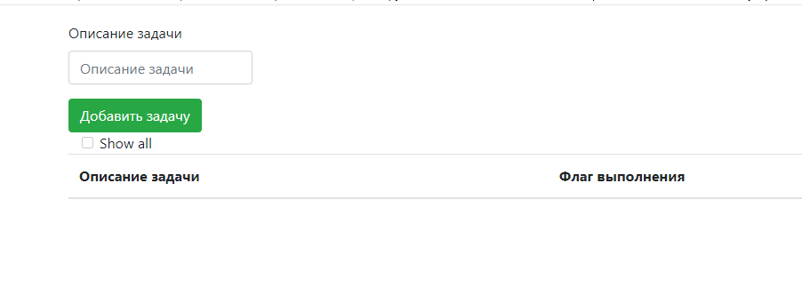
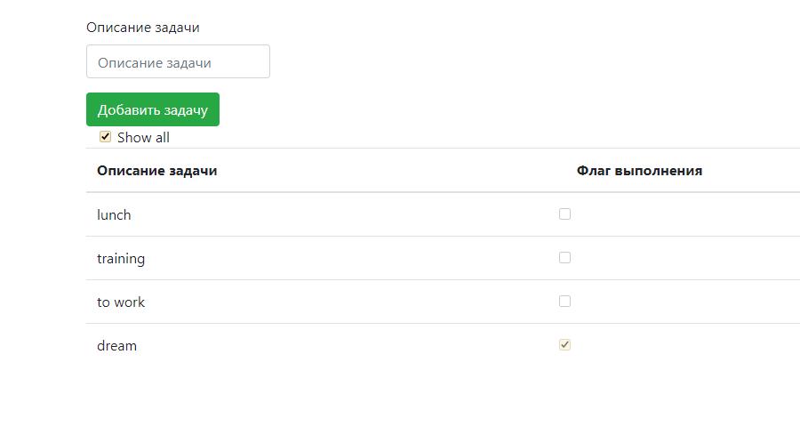
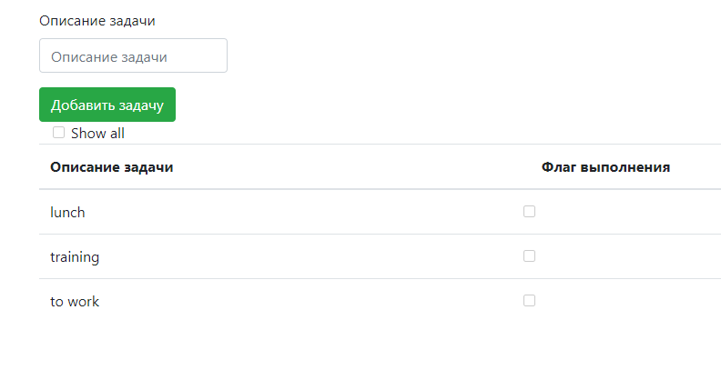

# job4j_todo
### Техническое задание - проект "TODO список". Список заданий.
"TODO список" состоит поля ввода, описания задачи. Кнопки добавления задачи.
А также в нижней части есть табличная часть, куда выводиться список задач.

Флаг Show All определяет, выводить все задачи

или только не выполненные.

Список задач хранятся в БД Postgres SQL, работу с БД организована через Hibernate.